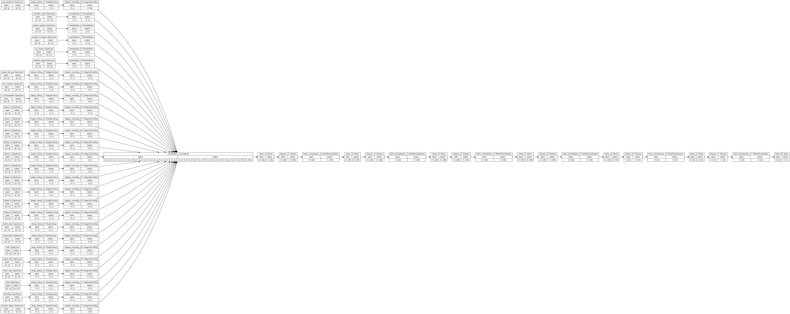
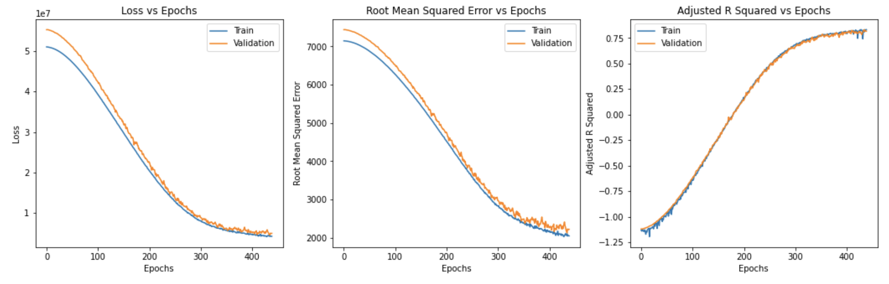
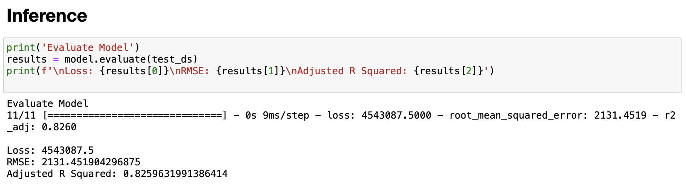

# Predicting Prices of Used Cars using Deep Neural Networks

## Motivation

Regression is a a very important type of data analysis and a core assest in a practioner's toolbox. I have performed regression on many datasets using Scikit-learn and TensorFlow. As I continue to expand my toolbox, I wanted to perform regression analysis using TensorFlow's preprocessing layers. The reason I chose predicting prices of used cars is because most people, at least that I know, usually buy used as opposed to new so I wanted to perform regression analysis on the former.

## About Dataset

The dataset is collected from various web resources in order to explore the used cars market and try to build a model that effectively predicts the price of the car based on its parameters (both numerical and categorical). The data is scraped in Belarus (western Europe) on the 2nd of December 2019. [https://www.kaggle.com/lepchenkov/usedcarscatalog]

## Results

The model layers, including preprocessing layers, can be seen below:

The training metrics can be seen below:

Inference on new data can be seen below:

